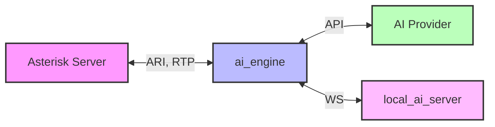

<div align="center">

# Asterisk AI Voice Agent


[](https://deepwiki.com/hkjarral/Asterisk-AI-Voice-Agent)
[](https://discord.gg/ysg8fphxUe)

The most powerful, flexible open-source AI voice agent for Asterisk/FreePBX. Featuring a **modular pipeline architecture** that lets you mix and match STT, LLM, and TTS providers, plus **5 production-ready golden baselines** validated for enterprise deployment.

[Quick Start](#-quick-start) • [Features](#-features) • [Demo](#-demo) • [Docs](docs/README.md) • [Community](#-community)

</div>

---

## 📖 Table of Contents

- [🚀 Quick Start](#-quick-start)
- [🎉 What's New](#-whats-new-in-v521)
- [🌟 Why Asterisk AI Voice Agent?](#-why-asterisk-ai-voice-agent)
- [✨ Features](#-features)
- [🎥 Demo](#-demo)
- [🛠️ AI-Powered Actions](#-ai-powered-actions-v43)
- [🩺 Agent CLI Tools](#-agent-cli-tools)
- [⚙️ Configuration](#-configuration)
- [🏗️ Project Architecture](#-project-architecture)
- [📊 Requirements](#-requirements)
- [🗺️ Documentation](#-documentation)
- [🤝 Contributing](#-contributing)
- [💬 Community](#-community)
- [📝 License](#-license)

---

## 🚀 Quick Start

Get the **Admin UI running in 2 minutes**.

For a complete **first successful call** walkthrough (dialplan + transport selection + verification), see:
- **[Installation Guide](docs/INSTALLATION.md)**
- **[Transport Compatibility](docs/Transport-Mode-Compatibility.md)**

### 1. Run Pre-flight Check (Required)

```bash
# Clone repository
git clone https://github.com/hkjarral/Asterisk-AI-Voice-Agent.git
cd Asterisk-AI-Voice-Agent

# Run preflight with auto-fix (creates .env, generates JWT_SECRET)
sudo ./preflight.sh --apply-fixes
```

> **Important:** Preflight creates your `.env` file and generates a secure `JWT_SECRET`. Always run this first!

### 2. Start the Admin UI

```bash
# Start the Admin UI container
docker compose up -d --build admin_ui
```

### 3. Access the Dashboard

Open in your browser:
- **Local:** `http://localhost:3003`
- **Remote server:** `http://<server-ip>:3003`

**Default Login:** `admin` / `admin`

Follow the **Setup Wizard** to configure your providers and make a test call.

> ⚠️ **Security:** The Admin UI is accessible on the network. **Change the default password immediately** and restrict port 3003 via firewall, VPN, or reverse proxy for production use.

### 4. Verify Installation

```bash
# Start ai_engine (required for health checks)
docker compose up -d --build ai_engine

# Check ai_engine health
curl http://localhost:15000/health
# Expected: {"status":"healthy"}

# View logs for any errors
docker compose logs ai_engine | tail -20
```

### 5. Connect Asterisk

The wizard will generate the necessary dialplan configuration for your Asterisk server.

Transport selection is configuration-dependent (not strictly “pipelines vs full agents”). Use the validated matrix in:
- **[docs/Transport-Mode-Compatibility.md](docs/Transport-Mode-Compatibility.md)**

---

## 🔧 Advanced Setup (CLI)

For users who prefer the command line or need headless setup.

### Option A: Interactive CLI
```bash
./install.sh
agent setup
```

> Note: Legacy commands `agent init`, `agent doctor`, and `agent troubleshoot` remain available as hidden aliases in CLI v5.2.1.

### Option B: Manual Setup
```bash
# Configure environment
cp .env.example .env
# Edit .env with your API keys

# Start services
docker compose up -d
```

### Configure Asterisk Dialplan
Add this to your FreePBX (`extensions_custom.conf`):
```asterisk
[from-ai-agent]
exten => s,1,NoOp(Asterisk AI Voice Agent v5.2.1)
 ; Optional per-call overrides:
 ; - AI_PROVIDER selects a provider/pipeline (otherwise uses default_provider from ai-agent.yaml)
 ; - AI_CONTEXT selects a context/persona (otherwise uses default context)
 same => n,Set(AI_PROVIDER=google_live)
 same => n,Set(AI_CONTEXT=sales-agent)
 same => n,Stasis(asterisk-ai-voice-agent)
 same => n,Hangup()
```
Notes:
- `AI_PROVIDER` is optional. If unset, the engine follows normal precedence (context provider → default_provider).
- `AI_CONTEXT` is optional. Use it to change greeting/persona without changing your default provider/pipeline.
- See `docs/FreePBX-Integration-Guide.md` for channel variable precedence and examples.

### Test Your Agent
**Health check:**
```bash
agent check
```

**View logs:**
```bash
docker compose logs -f ai_engine
```

---

## 🎉 What's New in v5.2.1

<details open>
<summary><b>Latest Updates</b></summary>

### 🔄 Updates UX (v5.2.1)
- Admin UI: **System → Updates** page (GitHub-style): check updates → choose branch → preview impact → proceed
- Preview shows **files changed** and **containers to rebuild/restart** (with opt-in “Update UI too”)
- Detached updater job survives `admin_ui` rebuild/restarts and keeps a **Recent Runs** summary with rollback options

For full release notes, see [CHANGELOG.md](CHANGELOG.md).

</details>

<details>
<summary><b>Previous Versions</b></summary>

#### v4.4.3 - Cross-Platform Support
- **🌍 Pre-flight Script**: System compatibility checker with auto-fix mode.
- **🔧 Admin UI Fixes**: Models page, providers page, dashboard improvements.
- **🛠️ Developer Experience**: Code splitting, ESLint + Prettier.

#### v4.4.2 - Local AI Enhancements
- **🎤 New STT Backends**: Kroko ASR, Sherpa-ONNX.
- **🔊 Kokoro TTS**: High-quality neural TTS.
- **🔄 Model Management**: Dynamic backend switching from Dashboard.
- **📚 Documentation**: LOCAL_ONLY_SETUP.md guide.

#### v4.4.1 - Admin UI v1.0
- **🖥️ Admin UI v1.0**: Modern web interface (http://localhost:3003).
- **🎙️ ElevenLabs Conversational AI**: Premium voice quality provider.
- **🎵 Background Music**: Ambient music during AI calls.

#### v4.3 - Complete Tool Support & Documentation
- **🔧 Complete Tool Support**: Works across ALL pipeline types.
- **📚 Documentation Overhaul**: Reorganized structure.
- **💬 Discord Community**: Official server integration.

#### v4.2 - Google Live API & Enhanced Setup
- **🤖 Google Live API**: Gemini 2.0 Flash integration.
- **🚀 Interactive Setup**: `agent init` wizard (`agent quickstart` remains available for backward compatibility).

#### v4.1 - Tool Calling & Agent CLI
- **🔧 Tool Calling System**: Transfer calls, send emails.
- **🩺 Agent CLI Tools**: `doctor`, `troubleshoot`, `demo`.

</details>

---

## 🌟 Why Asterisk AI Voice Agent?

| Feature | Benefit |
|---------|---------|
| **Asterisk-Native** | Works directly with your existing Asterisk/FreePBX - no external telephony providers required. |
| **Truly Open Source** | MIT licensed with complete transparency and control. |
| **Modular Architecture** | Choose cloud, local, or hybrid - mix providers as needed. |
| **Production-Ready** | Battle-tested baselines with Call History-first debugging. |
| **Cost-Effective** | Local Hybrid costs ~$0.001-0.003/minute (LLM only). |
| **Privacy-First** | Keep audio local while using cloud intelligence. |

---

## ✨ Features

### 5 Golden Baseline Configurations

1. **OpenAI Realtime** (Recommended for Quick Start)
   - Modern cloud AI with natural conversations (<2s response).
   - Config: `config/ai-agent.golden-openai.yaml`
   - *Best for: Enterprise deployments, quick setup.*

2. **Deepgram Voice Agent** (Enterprise Cloud)
   - Advanced Think stage for complex reasoning (<3s response).
   - Config: `config/ai-agent.golden-deepgram.yaml`
   - *Best for: Deepgram ecosystem, advanced features.*

3. **Google Live API** (Multimodal AI)
   - Gemini Live (Flash) with multimodal capabilities (<2s response).
   - Config: `config/ai-agent.golden-google-live.yaml`
   - *Best for: Google ecosystem, advanced AI features.*

4. **ElevenLabs Agent** (Premium Voice Quality)
   - ElevenLabs Conversational AI with premium voices (<2s response).
   - Config: `config/ai-agent.golden-elevenlabs.yaml`
   - *Best for: Voice quality priority, natural conversations.*

5. **Local Hybrid** (Privacy-Focused)
   - Local STT/TTS + Cloud LLM (OpenAI). Audio stays on-premises.
   - Config: `config/ai-agent.golden-local-hybrid.yaml`
   - *Best for: Audio privacy, cost control, compliance.*

### Fully Local (Optional)

AVA also supports a **Fully Local** mode (100% on-premises, no cloud APIs). This is **not** one of the golden baselines because performance depends heavily on your hardware (especially the local LLM).

- See: `docs/LOCAL_ONLY_SETUP.md`
- Hardware guidance: `docs/HARDWARE_REQUIREMENTS.md`

### 🏠 Self-Hosted LLM with Ollama (No API Key Required)

Run your own local LLM using [Ollama](https://ollama.ai) - perfect for privacy-focused deployments:

```yaml
# In ai-agent.yaml
active_pipeline: local_ollama
```

**Features:**

- **No API key required** - fully self-hosted on your network
- **Tool calling support** with compatible models (Llama 3.2, Mistral, Qwen)
- Local Vosk STT + Your Ollama LLM + Local Piper TTS
- Complete privacy - all processing stays on-premises

**Requirements:**

- Mac Mini, gaming PC, or server with Ollama installed
- 8GB+ RAM (16GB+ recommended for larger models)
- See [docs/OLLAMA_SETUP.md](docs/OLLAMA_SETUP.md) for setup guide

**Recommended Models:**

| Model | Size | Tool Calling |
|-------|------|--------------|
| `llama3.2` | 2GB | ✅ Yes |
| `mistral` | 4GB | ✅ Yes |
| `qwen2.5` | 4.7GB | ✅ Yes |

### Technical Features

- **Tool Calling System**: AI-powered actions (transfers, emails) work with any provider.
- **Agent CLI Tools**: `setup`, `check`, `rca`, `update`, `version` commands (legacy aliases: `init`, `doctor`, `troubleshoot`).
- **Modular Pipeline System**: Independent STT, LLM, and TTS provider selection.
- **Dual Transport Support**: AudioSocket and ExternalMedia RTP (the shipped default config uses ExternalMedia; both are supported — see the transport matrix).
- **Streaming-First Downstream**: Streaming playback when possible, with automatic fallback to file playback for robustness.
- **High-Performance Architecture**: Separate `ai_engine` and `local_ai_server` containers.
- **Observability**: Built-in **Call History** for per-call debugging + optional `/metrics` scraping.
- **State Management**: SessionStore for centralized, typed call state.
- **Barge-In Support**: Interrupt handling with configurable gating.

### 🖥️ Admin UI v1.0

Modern web interface for configuration and system management.

**Quick Start:**
```bash
docker compose up -d admin_ui
# Access at: http://localhost:3003
# Login: admin / admin (change immediately!)
```

**Key Features:**
- **Setup Wizard**: Visual provider configuration.
- **Dashboard**: Real-time system metrics and container status.
- **Live Logs**: WebSocket-based log streaming.
- **YAML Editor**: Monaco-based editor with validation.

---

## 🎥 Demo

[](https://www.youtube.com/watch?v=ZGrr9-Q85xA "Asterisk AI Voice Agent demo")

### 📞 Try it Live! (US Only)

Experience our production-ready configurations with a single phone call:

**Dial: (925) 736-6718**

- **Press 5** → Google Live API (Multimodal AI with Gemini 2.0)
- **Press 6** → Deepgram Voice Agent (Enterprise cloud with Think stage)
- **Press 7** → OpenAI Realtime API (Modern cloud AI, most natural)
- **Press 8** → Local Hybrid Pipeline (Privacy-focused, audio stays local)
- **Press 9** → ElevenLabs Agent (Santa voice with background music)
- **Press 10** → Fully Local Pipeline (100% on-premises, CPU-based)

---

## 🛠️ AI-Powered Actions (v4.3+)

Your AI agent can perform real-world telephony actions through tool calling.

### Unified Call Transfers

```text
Caller: "Transfer me to the sales team"
Agent: "I'll connect you to our sales team right away."
[Transfer to sales queue with queue music]
```

**Supported Destinations:**
- **Extensions**: Direct SIP/PJSIP endpoint transfers.
- **Queues**: ACD queue transfers with position announcements.
- **Ring Groups**: Multiple agents ring simultaneously.

### Call Control & Voicemail

- **Cancel Transfer**: "Actually, cancel that" (during ring).
- **Hangup Call**: Ends call gracefully with farewell.
- **Voicemail**: Routes to voicemail box.

### Email Integration

- **Automatic Call Summaries**: Admins receive full transcripts and metadata.
- **Caller-Requested Transcripts**: "Email me a transcript of this call."

| Tool | Description | Status |
|------|-------------|--------|
| `transfer` | Transfer to extensions, queues, or ring groups | ✅ |
| `cancel_transfer` | Cancel in-progress transfer (during ring) | ✅ |
| `hangup_call` | End call gracefully with farewell message | ✅ |
| `leave_voicemail` | Route caller to voicemail extension | ✅ |
| `send_email_summary` | Auto-send call summaries to admins | ✅ |
| `request_transcript` | Caller-initiated email transcripts | ✅ |

---

## 🩺 Agent CLI Tools

Production-ready CLI for operations and setup.

**Installation:**
```bash
curl -sSL https://raw.githubusercontent.com/hkjarral/Asterisk-AI-Voice-Agent/main/scripts/install-cli.sh | bash
```

**Commands:**
```bash
agent setup               # Interactive setup wizard (recommended)
agent check               # Standard diagnostics report (share this output when asking for help)
agent update              # Pull latest code + rebuild/restart as needed
agent rca --call <call_id> # Post-call RCA (use Call History to find call_id)
agent version             # Version information
```

---

## ⚙ Configuration

### Two-File Configuration
- **[`config/ai-agent.yaml`](config/ai-agent.yaml)** - Golden baseline configs.
- **[`.env`](.env.example)** - Secrets and API keys (git-ignored).

**Example `.env`:**
```bash
OPENAI_API_KEY=sk-your-key-here
DEEPGRAM_API_KEY=your-key-here
ASTERISK_ARI_USERNAME=asterisk
ASTERISK_ARI_PASSWORD=your-password
```

### Optional: Metrics (Bring Your Own Prometheus)
The engine exposes Prometheus-format metrics at `http://<engine-host>:15000/metrics`.
Per-call debugging is handled via **Admin UI → Call History**.

---

## 🏗 Project Architecture

Two-container architecture for performance and scalability:

1. **`ai_engine`** (Lightweight orchestrator): Connects to Asterisk via ARI, manages call lifecycle.
2. **`local_ai_server`** (Optional): Runs local STT/LLM/TTS models (Vosk, Sherpa, Kroko, Piper, Kokoro, llama.cpp).



---

## 📊 Requirements

### Platform Requirements

| Requirement | Details |
|-------------|---------|
| **Architecture** | x86_64 (AMD64) only |
| **OS** | Linux with systemd |
| **Supported Distros** | Ubuntu 20.04+, Debian 11+, RHEL/Rocky/Alma 8+, Fedora 38+, Sangoma Linux |

> **Note:** ARM64 (Apple Silicon, Raspberry Pi) is not currently supported. See [Supported Platforms](docs/SUPPORTED_PLATFORMS.md) for the full compatibility matrix.

### Minimum System Requirements

| Type | CPU | RAM | Disk |
|------|-----|-----|------|
| **Cloud** (OpenAI/Deepgram) | 2+ cores | 4GB | 1GB |
| **Local Hybrid** | 4+ cores | 8GB+ | 2GB |

### Software Requirements

- Docker + Docker Compose v2
- Asterisk 18+ with ARI enabled
- FreePBX (recommended) or vanilla Asterisk

### Preflight Automation

The `preflight.sh` script handles initial setup:
- Seeds `.env` from `.env.example` with your settings
- Prompts for Asterisk config directory location
- Sets `ASTERISK_UID`/`ASTERISK_GID` to match host permissions (fixes media access issues)
- Re-running preflight often resolves permission problems

---

## 🗺 Documentation

### Getting Started
- **[Docs Index](docs/README.md)**
- **[FreePBX Integration Guide](docs/FreePBX-Integration-Guide.md)**
- **[Installation Guide](docs/INSTALLATION.md)**

### Configuration & Operations
- **[Configuration Reference](docs/Configuration-Reference.md)**
- **[Transport Compatibility](docs/Transport-Mode-Compatibility.md)**
- **[Tuning Recipes](docs/Tuning-Recipes.md)**
- **[Supported Platforms](docs/SUPPORTED_PLATFORMS.md)**
- **[Local Profiles](docs/LOCAL_PROFILES.md)**
- **[Monitoring Guide](docs/MONITORING_GUIDE.md)**

### Development
- **[Developer Documentation](docs/contributing/README.md)**
- **[Architecture Deep Dive](docs/contributing/architecture-deep-dive.md)**
- **[Contributing Guide](CONTRIBUTING.md)**

---

## 🤝 Contributing

Contributions are welcome! Please see our [Contributing Guide](CONTRIBUTING.md).

### 👩‍💻 For Developers
- [Developer Quickstart](docs/contributing/quickstart.md)
- [Developer Documentation](docs/contributing/README.md)

---

## 💬 Community

- **[Discord Server](https://discord.gg/ysg8fphxUe)** - Support and discussions
- [GitHub Issues](https://github.com/hkjarral/Asterisk-AI-Voice-Agent/issues) - Bug reports
- [GitHub Discussions](https://github.com/hkjarral/Asterisk-AI-Voice-Agent/discussions) - General chat

---

## 📝 License

This project is licensed under the MIT License. See the [LICENSE](LICENSE) file for details.

---

## 💖 Support This Project

Asterisk AI Voice Agent is **free and open source**. If it's saving you money, consider supporting development:

<p align="center">
  <a href="https://github.com/sponsors/hkjarral">
    
  </a>
  <a href="https://ko-fi.com/asteriskaivoiceagent">
    
  </a>
  <a href="https://meetify.com/aava1">
    
  </a>
</p>

Your support funds:
- 🐛 Faster bug fixes and issue responses  
- ✨ New provider integrations and features  
- 📚 Better documentation and tutorials

If you find this project useful, please also give it a ⭐️!

## Star History

[](https://www.star-history.com/#hkjarral/Asterisk-AI-Voice-Agent&type=date&legend=top-left)
